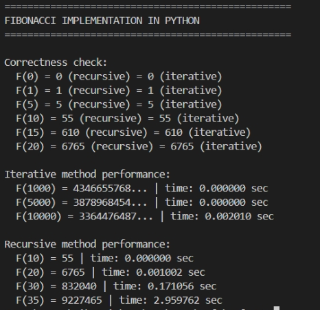
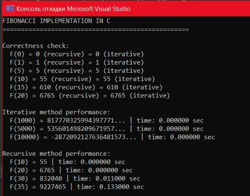

## Отчёт по лабораторной работе №4

**Дисциплина:** Разработка инструментального программного обеспечения  
**Тема:** Реализация одной и той же библиотеки на двух языках. Сравнение их эффективности, удобства использования и особенностей  
**Выполнила:** Екатерина Сабынина  
**Группа:** 222  

---

### 1. Цель работы

Научиться разрабатывать одинаковую функциональность на двух языках программирования и провести сравнительный анализ по производительности и удобству реализации.

---

### 2. Выбранные языки и задача

**C++** — компилируемый язык, статическая типизация. Используется для высокопроизводительных вычислений и системного программного обеспечения.

**Python** — интерпретируемый язык, динамическая типизация. Используется для быстрой разработки, написания скриптов и анализа данных.

**Задача:** вычисление чисел Фибоначчи рекурсивным и итеративным методами.

---

### 3. Результаты выполнения

#### 3.1 Реализация на C++

**Ключевые результаты C++:**
- F(1000) = 817770325994397771
- F(5000) = 535601498209671957
- F(10000) = **-2872092127636481573** (переполнение)
- Время рекурсивного вычисления F(35) = 0.133 секунды

#### 3.2 Реализация на Python

**Ключевые результаты Python:**
- F(1000), F(5000), F(10000) — корректные большие числа (без переполнения)
- Время рекурсивного вычисления F(35) = 2.96 секунды

---

### 4. Сравнение языков

| Параметр | C++ | Python |
|----------|-----|--------|
| Время рекурсии F(35) | 0.133 сек | 2.96 сек |
| Итеративно F(10000) | ≈ 0 сек (но с переполнением) | 0.002 сек (корректно) |
| Поддержка больших чисел | нет (только long long) | да (неограниченно) |
| Читаемость кода | средняя (нужно объявлять типы) | высокая (минималистичный синтаксис) |

C++ быстрее Python примерно в **22 раза** на рекурсивных вычислениях.

---

### 5. Выводы

- **C++** значительно быстрее Python, но не поддерживает большие числа и требует более объёмного кода.
- **Python** медленнее, но удобнее для работы с большими данными и быстрого прототипирования.

Для задач, где критична скорость и не требуется работа со сверхбольшими числами, лучше подходит **C++**.  
Для прототипирования, анализа данных и быстрой разработки — **Python**.

добавление в репозиторий: https://github.com/EkaterinaSabunina/rabota4

